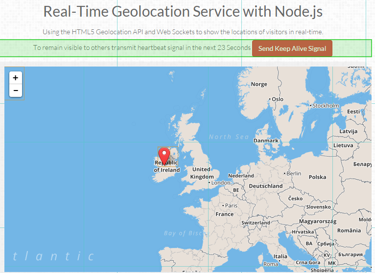

## Realtime Geo-Location

This App implements a Leaflet based map this is updated in realtime with each users location.
The App uses [NodeJS](http://nodejs.org/) and [ExpressJS](http://expressjs.com/) at the back end with [AngularJS](https://angularjs.org/), [LeafletJS](http://leafletjs.com/) and [Socket.io](socket.io) at the from end.
I have also used [BT Ford's](https://github.com/btford/angular-socket-io) module for using Angular with Socket.io. 

This program is based on the [realtime-geolocation-demo of Dmitri Voronianski](https://github.com/voronianski/realtime-geolocation-demo).

### Running the App

- clone the repository
- npm install
- bower install
- node server.js
- browse to _http://localhost:3000/_

## Screen Shot

		

Michael Cullen 2014
